# SDRStudio: Modernizing Software Defined Radio Interfaces

## Introduction

- **What it does:** SDRStudio is a modern, web-based control platform that allows users to remotely manage and monitor Software Defined Radios (SDR) through an intuitive browser dashboard.
- **How it works:** It uses a decoupled architecture, pairing a responsive React frontend with a powerful, headless C++ DSP engine (SDRangel) for real-time signal processing and spectrum analysis.
- **Why it is helpful:** By replacing cluttered desktop software with a streamlined interface, it significantly lowers the learning curve and simplifies complex SDR operations, such as transmitting Digital Amateur TV (DATV).

This document contains flowcharts and conceptual illustrations designed for your SDRStudio poster presentation.

## Architectural Flowchart

This flowchart illustrates the high-level architecture and data flow between the React frontend (SDRStudio-Web) and the headless C++ backend (SDRangel).

```mermaid
%%{init: {'theme': 'base', 'themeVariables': { 'primaryColor': '#1e293b', 'primaryTextColor': '#ffffff', 'primaryBorderColor': '#3b82f6', 'lineColor': '#94a3b8', 'clusterBkg': 'transparent', 'clusterBorder': 'transparent'}, 'flowchart': {'curve': 'basis'}}}%%
graph LR
    %% Frontend Components
    subgraph Frontend [ SDRStudio-Web (React + Vite) ]
        direction TB
        UI([🖥️ Web Interface])
        API_Client([🔌 REST API Client])
        WS_Client([⚡ WebSocket Client])
        Media_Uploader([📁 Media Uploader])
    end

    %% Network / Comm Layer
    subgraph Communication [ Communication Layer ]
        direction TB
        REST_HTTP{{🌐 HTTP GET/PATCH}}
        WS_WSS{{🔄 WebSocket Stream}}
        Media_HTTP{{📦 HTTP Multipart}}
    end

    %% Backend Components
    subgraph Backend [ SDRangel Headless Backend (C++) ]
        direction TB
        API_Server[[⚙️ REST API Server]]
        Spectrum_Server[[📊 Spectrum Server]]
        Core[(🧠 Core DSP Engine)]
        Modems[[📻 Modems / Codecs]]
        Hardware_HAL[[🔌 Hardware HAL]]
    end

    %% External Hardware
    subgraph Hardware [ SDR Hardware ]
        direction TB
        Pluto[/📡 PlutoSDR/]
        USRP[/📡 USRP/]
        HackRF[/📡 HackRF/]
    end

    %% Connections
    UI <--> |User Actions| API_Client
    UI <--> |Live Data| WS_Client
    UI --> |Uploads| Media_Uploader

    API_Client <--> |Control JSON| REST_HTTP
    WS_Client <--> |Binary FFT Data| WS_WSS
    Media_Uploader --> |.ts/.mp4| Media_HTTP

    REST_HTTP <--> API_Server
    WS_WSS <--> Spectrum_Server
    Media_HTTP --> API_Server

    API_Server <--> Core
    API_Server <--> Modems
    Spectrum_Server <--> Core
    
    Core <--> Modems
    Core <--> Hardware_HAL
    Hardware_HAL <--> Pluto
    Hardware_HAL <--> USRP
    Hardware_HAL <--> HackRF

    %% Styling
    classDef frontend fill:#2563eb,stroke:#60a5fa,stroke-width:2px,color:#fff;
    classDef backend fill:#059669,stroke:#34d399,stroke-width:2px,color:#fff;
    classDef comms fill:#7c3aed,stroke:#a78bfa,stroke-width:2px,color:#fff;
    classDef hw fill:#ea580c,stroke:#fb923c,stroke-width:2px,color:#fff;

    class UI,API_Client,WS_Client,Media_Uploader frontend;
    class Core,API_Server,Spectrum_Server,Modems,Hardware_HAL backend;
    class REST_HTTP,WS_WSS,Media_HTTP comms;
    class Pluto,USRP,HackRF hw;
```

## Internal Component Interaction (Focus on DATV Modulator)

This flowchart goes deeper into a specific workflow: the Digital Amateur TV (DATV) Modulator pipeline. It's a great example of how a complex plugin functions within the ecosystem.

```mermaid
%%{init: {'theme': 'base', 'themeVariables': { 'primaryColor': '#1e293b', 'primaryTextColor': '#ffffff', 'lineColor': '#3b82f6', 'actorBkg': '#2563eb', 'actorBorder': '#60a5fa', 'actorTextColor': '#ffffff', 'signalColor': '#a78bfa', 'signalTextColor': '#f8fafc'}}}%%
sequenceDiagram
    autonumber
    participant User as 👤 User
    participant Frontend as 🖥️ SDRStudio-Web
    participant API as ⚙️ Backend API
    participant Baseband as 📻 DATVModBaseband
    participant ModSource as 📡 DATVModSource
    participant Hardware as 🎛️ PlutoSDR

    User->>Frontend: Clicks "Upload Media"
    Frontend->>API: POST /api/upload (.ts File)
    API-->>Frontend: Returns File Path
    
    User->>Frontend: Clicks "▶ Play"
    Frontend->>API: PATCH Channel (tsFilePlay=1)
    
    API->>Baseband: Push MsgConfigureTsFileName
    Baseband->>ModSource: openTsFile()
    ModSource->>ModSource: Calculate Data Bitrate
    
    API->>Baseband: Push MsgConfigureDATVMod
    Baseband->>ModSource: applySettings()
    
    rect rgb(15, 23, 42)
        loop Every DSP Cycle (Real-Time)
            ModSource->>ModSource: Read MPEG-TS Packet
            ModSource->>ModSource: Forward Error Correction (FEC)
            ModSource->>ModSource: QPSK/8PSK Constellation Mapping
            ModSource->>ModSource: Root Raised Cosine Filter
            ModSource->>Hardware: Push I/Q Samples
            Hardware->>Hardware: Upconvert & Transmit RF Signal
        end
    end
```



## Presentation Graphics

Here are some high-quality AI-generated illustrations that represent the concepts behind SDRStudio. You can embed these in your poster to add visual flair.

````carousel

<!-- slide -->

<!-- slide -->

````

## Main Challenges Faced

- **Frontend/Backend Synchronization:** Managing race conditions where the web dashboard polls the REST API before the C++ DSP engine has fully initialized, which originally caused backend segmentation faults.
- **Persistent Media Playback:** Ensuring stable DATV video playback and seeking. This required robust file-stream handling in the C++ backend to prevent stream locks and ensure file descriptors were properly closed during transitions.
- **Complex Parameter Mapping:** Simplifying hundreds of dense SDR parameters into a modern, dynamic web interface while maintaining the granular control required for professional radio operations.
- **High-Bandwidth Spectrum Streaming:** Optimizing WebSocket binary data transfers to provide a responsive, live 60fps spectrum view without overwhelming the browser's thread or the headless server.

